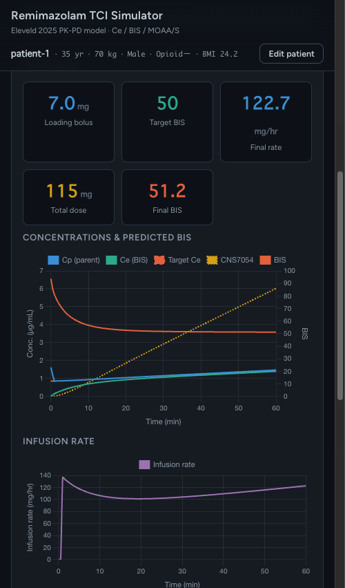

# Remimazolam TCI Simulator (Eleveld 2025)

レミマゾラムの薬物動態・薬力学（PK-PD）シミュレータです。**Eleveld 2025 モデル**を実装し、
効果部位濃度 (Ce)・予測 **BIS**・**MOAA/S** をリアルタイムに計算・表示します。活性代謝物
**CNS7054** の蓄積と、それによる BIS への競合的拮抗（耐性現象）も再現します。

HTML / JavaScript / PWA で実装され、ビルド不要・オフライン動作します。

🔗 **Live (PWA):** https://ysuzuki1978.github.io/remimazolam-eleveld-simulator/
&nbsp;·&nbsp; **Source:** https://github.com/ysuzuki1978/remimazolam-eleveld-simulator

> ⚠️ **研究・教育目的のシミュレータです。臨床判断や実際の薬剤投与には使用しないでください。**



---

## 主な機能

3 つのモードを備えています。

1. **導入（リアルタイム）**：初回ボーラス（既定 0.1 mg/kg）＋持続注入を実時間で進行させ、Ce / 予測 BIS / MOAA/S
   をライブ描画。追加ボーラス・LOC スナップショット記録に対応。LOC を記録すると、**その効果部位 Ce + 0.15 µg/mL**
   を TCI の目標 Ce として投与計画タブへ送れます。
2. **TCI / 投与計画**
   - **効果部位 Ce 目標**：目標 Ce から負荷ボーラスと維持注入速度のスケジュールを自動算出（効果部位 TCI）。
   - **★ 目標 BIS 維持（60 / 50 / 40）**：目標 BIS から必要な効果部位 Ce を逆算し、代謝物 CNS7054 の蓄積に
     応じて必要 Ce・注入速度を**漸増**させ、BIS を一定に保ちます（**耐性現象の再現**）。
3. **モニタリング**：任意の投与イベント列（複数ボーラス＋持続変更）→ 全時系列をグラフ表示・CSV 出力。

共変量：年齢・体重・性別・オピオイド併用・肝機能 (Pugh-Child > 8)・腎機能 (ESRD)。

新しいバージョンを公開すると、アプリ下部に「新しいバージョンがあります」バナーが表示され、
「更新」をタップすると最新版へ再読み込みします（Service Worker の更新検知）。

## モデルの要点

実装は論文本文（Table 1, Fig 1）と Supplementary（NONMEM `$PK`/`$DES`/`$THETA`/`$ERR`）に厳密準拠しています。

- **状態ベクトルは 8 変数**：親薬中心 + 末梢 ×2 + depot（front-end kinetics）+ 代謝物中心 + 代謝物末梢
  + 効果部位 ×2（BIS 用 ke0 = 0.145、MOAA/S 用 ke0 = 0.298 min⁻¹）。RK4 で積分。
- **BIS の sigmoid 指数 γ = 1**。NONMEM コードの BIS 式に指数項はなく、論文も「γ の推定は適合を改善せず
  最終モデルから除外」と明記しています。MOAA/S（比例オッズ）も同様に γ = 1。
- **代謝物に独立した効果部位はありません**。CNS7054 の**中心（血漿）濃度**が BIS / MOAA/S を競合的に拮抗します。
- BIS = Baseline · (1 − (Ce/Ce50) / (1 + Ce/Ce50 + Ca/Ca50))、Baseline = 93.7、Ce50 = 0.982、Ca50 = 8.41（参照個体）。
- **目標 BIS → 必要 Ce の逆解**（閉形式）：

  E = 1 − BIS/Baseline,&nbsp;&nbsp; Ce = Ce50 · E·(1 + Ca/Ca50) / (1 − E)

  代謝物 Ca が増えるほど必要 Ce が上昇 → 一定 BIS を保つには注入速度を増やす必要がある（耐性）。
- 内部単位は mg / L / µg·mL⁻¹ で一貫。depot 転送に分子量補正 (425.3/439.3) を適用。

初版では静脈サンプル予測（venous delay）および ECMO / ICU 補正（論文 Table 2）は扱いません（TCI 用途では不要のため）。

## ローカルでの起動

```bash
python3 -m http.server 8000   # = npm run serve
# → http://localhost:8000
```

## モデル検証

```bash
npm run validate          # = model + TCI の全テスト
node validation/validate-model.js   # PK-PD コア（47 項目）
node validation/validate-tci.js     # TCI / BIS 目標（16 項目）
```

検証内容（主なもの）:

- 論文 Table 1 の全パラメータが逆算で一致（V1=4.31, CL=1.12, ke0_BIS=0.145, Ce50_BIS=0.982, Baseline=93.7 等）
- 数値積分の健全性（RK4 ≈ 細刻み Euler、効果部位ヒステリシス）
- **麻酔目標濃度（5.25 × Ce50_MOAA/S = 0.96 µg/mL）→ BIS ≈ 47.5**（論文の「麻酔 BIS ≈ 50」を再現）
- **加齢で必要 Ce・負荷ボーラスが低下**（Eleveld の核心主張を再現）
- 目標 BIS 60/50/40 を ±3 以内で維持し、代謝物蓄積に伴い注入速度が漸増（耐性）

## 既知の限界

- 集団モデルであり、個人間変動（特に BIS-PD: ke0 CV 85.5%, Ce50 CV 50.6%）は大きい。予測は集団平均。
- 著者は **BIS < 50 域で集団予測にバイアス**（ベンゾジアゼピンの天井効果）を報告。深鎮静域の予測は参考値。
- 静脈サンプル / ECMO / ICU 補正は未実装。

## 技術構成

ビルド不要のバニラ JS（globals）。`js/remimazolam-eleveld-pkpd.js` がモデル中核、各モードはエンジン
（induction / tci / monitoring）+ Chart.js + PWA（Service Worker）。

## 出典・ライセンス

PK-PD モデル（パラメータ・式）の出典：

> Eleveld DJ, Colin PJ, van den Berg JP, Koomen JV, Stoehr T, Struys MMRF.
> Development and analysis of a remimazolam pharmacokinetics and pharmacodynamics
> model with proposed dosing and concentrations for anaesthesia and sedation.
> *Br J Anaesth.* 2025;135(1):206-217. doi:[10.1016/j.bja.2025.02.038](https://doi.org/10.1016/j.bja.2025.02.038)
>
> © 2025 The Author(s). Open access, [CC BY 4.0](http://creativecommons.org/licenses/by/4.0/).

- モデルのパラメータ・式は **CC BY 4.0** に基づき原著者のクレジットを明記して利用しています（[NOTICE](NOTICE) 参照）。
- 本ソフトウェアの実装は **Apache License 2.0**（[LICENSE](LICENSE)）です。

## 関連

既存のプロポフォール TCI シミュレータ（Eleveld 2018）と同じ設計思想で実装されています。
